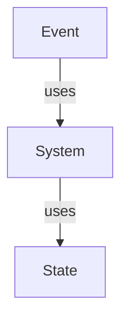
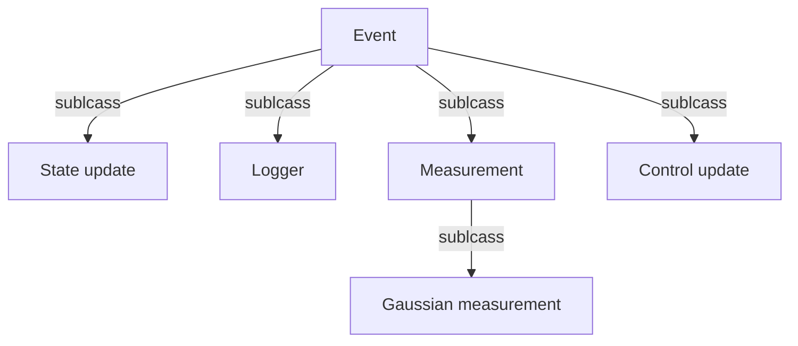

# Dynamics library

I'd like a thing to do kinematics / dynamics. I have one at work. I'd like to replicate some of it here.

The aim of this package is ease of use. I end up making many smaller (similar) simulations at work and at home, rather than one large one. This means I end up copying and pasting a lot of code around.
This library is formalising that and adding new features.

It's based on Dr X's library presented during university. The aim is to (re)implement the original, pillage the tests for correctness, then refactor how I want to work with it.

The simulation is event based with events, systems and states working together

Different types of event are provisioned for:

## Installation

1. Create python env: `python -m venv env`
2. Activate python env: `./env/Scripts/activate`
3. Install required packages: `pip install -r requirements.txt`
